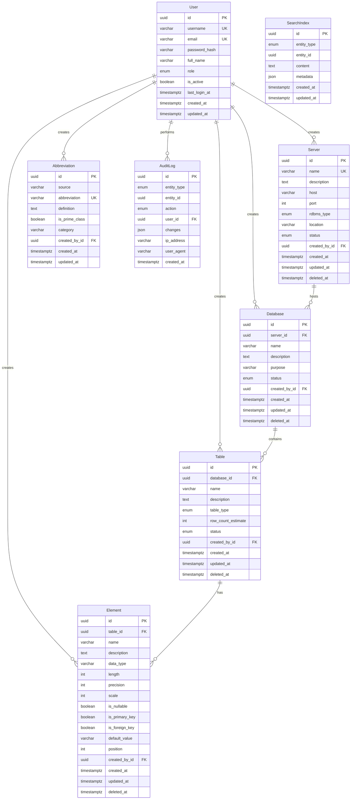
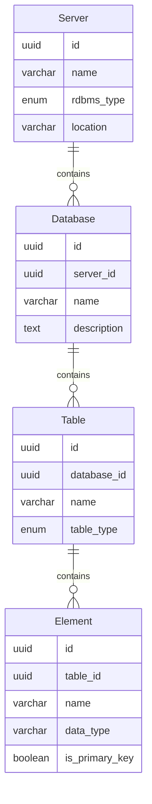
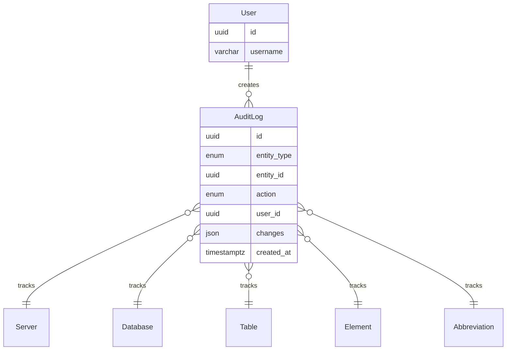

# SchemaJeli Entity-Relationship Diagram (ERD)

## Database Schema Visualization

This document contains the Entity-Relationship Diagram for the SchemaJeli metadata repository system.

## Complete ERD - All Tables and Relationships



## Core Hierarchy - Simplified View



## Audit Trail Relationships



## Data Dictionary

### Tables Overview

| Table | Purpose | Row Estimate | Partitioned |
|-------|---------|--------------|-------------|
| **users** | User accounts and authentication | 50-100 | No |
| **servers** | Database server registry | 50-100 | No |
| **databases** | Databases on servers | 500-1,000 | No |
| **tables** | Tables in databases | 10,000-50,000 | No |
| **elements** | Columns/fields in tables | 100,000-500,000 | No |
| **abbreviations** | Standard abbreviation dictionary | 5,000-10,000 | No |
| **audit_logs** | Change tracking for all entities | 1M+ (growing) | Yes (by month) |
| **search_index** | Full-text search optimization | Matches entities | No |

### Relationships Summary

**One-to-Many Relationships:**
- 1 User → Many Servers (created_by)
- 1 User → Many Databases (created_by)
- 1 User → Many Tables (created_by)
- 1 User → Many Elements (created_by)
- 1 User → Many Abbreviations (created_by)
- 1 User → Many AuditLogs (user)
- 1 Server → Many Databases (parent-child)
- 1 Database → Many Tables (parent-child)
- 1 Table → Many Elements (parent-child)

**Polymorphic Relationships:**
- AuditLog → Any Entity (via entity_type + entity_id)
- SearchIndex → Any Entity (via entity_type + entity_id)

### Unique Constraints

| Table | Constraint | Columns | Purpose |
|-------|-----------|---------|---------|
| users | username_unique | username | Prevent duplicate usernames |
| users | email_unique | email | Prevent duplicate emails |
| servers | name_unique | name | Prevent duplicate server names |
| databases | server_db_unique | (server_id, name) | Unique names per server |
| tables | db_table_unique | (database_id, name) | Unique names per database |
| elements | table_element_unique | (table_id, name) | Unique names per table |
| abbreviations | abbr_unique | abbreviation | Prevent duplicate abbreviations |

### Foreign Key Constraints

All foreign keys use **ON DELETE RESTRICT** to prevent orphaned records:

- `servers.created_by_id` → `users.id`
- `databases.server_id` → `servers.id`
- `databases.created_by_id` → `users.id`
- `tables.database_id` → `databases.id`
- `tables.created_by_id` → `users.id`
- `elements.table_id` → `tables.id`
- `elements.created_by_id` → `users.id`
- `abbreviations.created_by_id` → `users.id`
- `audit_logs.user_id` → `users.id`

### Indexes

**Primary Indexes:**
- All `id` columns (automatic B-tree)

**Unique Indexes:**
- `users.username`
- `users.email`
- `servers.name`
- `abbreviations.abbreviation`
- `databases.(server_id, name)` (composite)
- `tables.(database_id, name)` (composite)
- `elements.(table_id, name)` (composite)

**Performance Indexes:**
- `servers.status`
- `databases.server_id`
- `databases.name`
- `tables.database_id`
- `tables.name`
- `elements.table_id`
- `elements.name`
- `elements.is_primary_key`
- `elements.is_foreign_key`
- `abbreviations.source`
- `abbreviations.category`
- `audit_logs.(entity_type, entity_id)`
- `audit_logs.user_id`
- `audit_logs.created_at`
- `search_index.(entity_type, entity_id)`

**Full-Text Search Indexes:**
- `search_index.content` (GIN with pg_trgm)

### Soft Delete Pattern

Tables using soft delete (nullable `deleted_at` timestamp):
- `servers`
- `databases`
- `tables`
- `elements`

**Benefits:**
- Preserve historical data
- Enable "undelete" functionality
- Maintain referential integrity
- Support audit trail

**Implementation:**
```sql
-- Soft delete
UPDATE servers SET deleted_at = NOW() WHERE id = 'xxx';

-- Query active only
SELECT * FROM servers WHERE deleted_at IS NULL;

-- Restore
UPDATE servers SET deleted_at = NULL WHERE id = 'xxx';

-- Hard delete (admin only)
DELETE FROM servers WHERE deleted_at IS NOT NULL AND deleted_at < NOW() - INTERVAL '90 days';
```

## Enums

### UserRole
- `ADMIN` - Full system access
- `EDITOR` - Can create/edit metadata
- `VIEWER` - Read-only access

### EntityStatus
- `ACTIVE` - Currently in use
- `INACTIVE` - Temporarily disabled
- `ARCHIVED` - Historical, not in use

### RdbmsType
- `POSTGRESQL`
- `MYSQL`
- `ORACLE`
- `DB2`
- `INFORMIX`
- `SQLSERVER`

### TableType
- `TABLE` - Regular database table
- `VIEW` - Database view
- `MATERIALIZED_VIEW` - Materialized view

### AuditAction
- `CREATE` - Entity created
- `UPDATE` - Entity modified
- `DELETE` - Entity deleted (soft)
- `RESTORE` - Deleted entity restored

### EntityType
- `SERVER`
- `DATABASE`
- `TABLE`
- `ELEMENT`
- `ABBREVIATION`
- `USER`

## Query Examples

### Find all tables in a database with their columns
```sql
SELECT 
  t.name as table_name,
  e.name as column_name,
  e.data_type,
  e.is_primary_key,
  e.is_nullable
FROM tables t
JOIN elements e ON t.id = e.table_id
WHERE t.database_id = 'database-uuid'
  AND t.deleted_at IS NULL
  AND e.deleted_at IS NULL
ORDER BY t.name, e.position;
```

### Get full metadata hierarchy for a server
```sql
WITH RECURSIVE hierarchy AS (
  SELECT 
    s.id as server_id,
    s.name as server_name,
    d.id as database_id,
    d.name as database_name,
    t.id as table_id,
    t.name as table_name,
    COUNT(e.id) as column_count
  FROM servers s
  LEFT JOIN databases d ON s.id = d.server_id AND d.deleted_at IS NULL
  LEFT JOIN tables t ON d.id = t.database_id AND t.deleted_at IS NULL
  LEFT JOIN elements e ON t.id = e.table_id AND e.deleted_at IS NULL
  WHERE s.deleted_at IS NULL
  GROUP BY s.id, s.name, d.id, d.name, t.id, t.name
)
SELECT * FROM hierarchy
WHERE server_id = 'server-uuid';
```

### Search across all entities
```sql
SELECT 
  entity_type,
  entity_id,
  content
FROM search_index
WHERE content ILIKE '%search-term%'
ORDER BY created_at DESC
LIMIT 50;
```

### Audit trail for an entity
```sql
SELECT 
  al.action,
  al.changes,
  u.username,
  al.created_at
FROM audit_logs al
JOIN users u ON al.user_id = u.id
WHERE al.entity_type = 'TABLE'
  AND al.entity_id = 'table-uuid'
ORDER BY al.created_at DESC;
```
