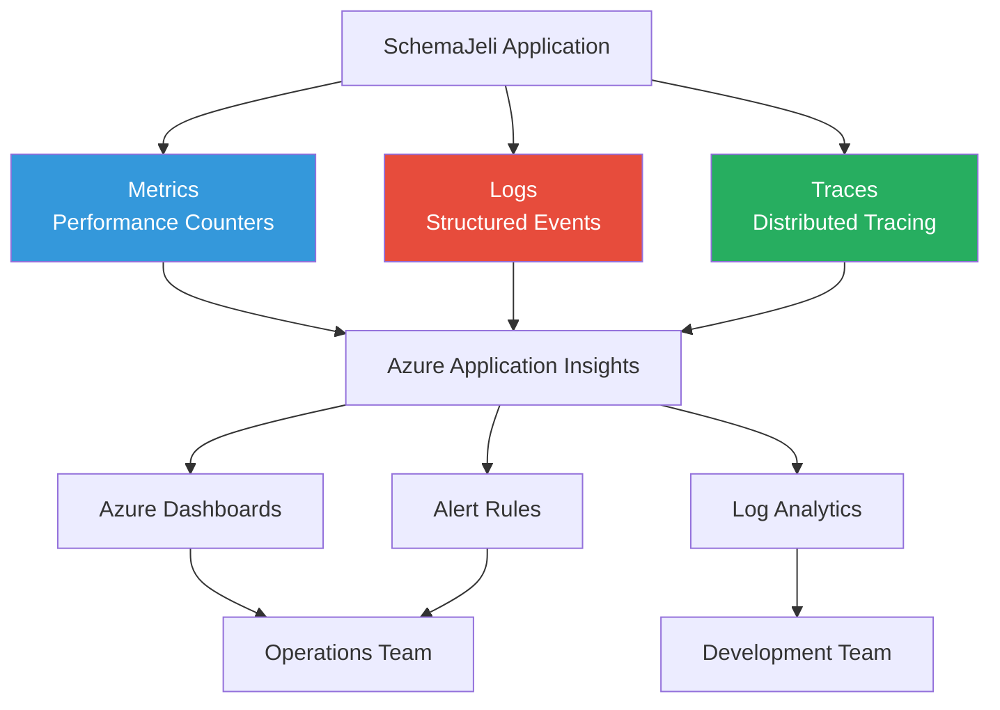

# Monitoring & Logging Architecture

**Project:** SchemaJeli  
**Phase:** 1.3.3 - Infrastructure & DevOps Setup  
**Version:** 1.0  
**Last Updated:** January 30, 2026

## Table of Contents
1. [Overview](#overview)
2. [Monitoring Strategy](#monitoring-strategy)
3. [Application Performance Monitoring (APM)](#application-performance-monitoring-apm)
4. [Logging Architecture](#logging-architecture)
5. [Metrics Collection](#metrics-collection)
6. [Alerting & Notifications](#alerting--notifications)
7. [Dashboard Design](#dashboard-design)
8. [Error Tracking](#error-tracking)
9. [Audit Logging](#audit-logging)
10. [Log Retention & Compliance](#log-retention--compliance)
11. [Observability Best Practices](#observability-best-practices)

---

## Overview

SchemaJeli implements **comprehensive observability** using Azure Application Insights for monitoring, structured logging with Winston, and custom metrics tracking. The system provides real-time visibility into application health, performance, and user behavior.

### Observability Pillars



### Key Objectives
- ✅ **Real-time monitoring**: Track application health and performance
- ✅ **Proactive alerting**: Detect issues before users report them
- ✅ **Root cause analysis**: Quickly diagnose and resolve problems
- ✅ **Audit compliance**: Track all data changes for compliance
- ✅ **Performance optimization**: Identify bottlenecks and optimize
- ✅ **Security monitoring**: Detect suspicious activities

### Technology Stack

| Component | Technology | Purpose |
|-----------|-----------|---------|
| **APM** | Azure Application Insights | Application monitoring |
| **Logging Library** | Winston | Structured logging |
| **Metrics** | Custom counters + App Insights | Performance metrics |
| **Error Tracking** | Sentry | Error aggregation & alerting |
| **Dashboards** | Azure Monitor Workbooks | Visualization |
| **Alerting** | Azure Monitor Alerts | Proactive notifications |
| **Log Storage** | Azure Log Analytics | Long-term log retention |

---

## Monitoring Strategy

### Monitoring Tiers

| Tier | Focus | Tools | Alert Severity |
|------|-------|-------|----------------|
| **Infrastructure** | CPU, memory, disk, network | Azure Monitor | 🔴 Critical |
| **Application** | Request rates, errors, latency | Application Insights | 🟠 High |
| **Business** | User activity, feature usage | Custom metrics | 🟡 Medium |
| **Security** | Failed logins, unauthorized access | Audit logs | 🔴 Critical |

### Golden Signals (SRE)

**1. Latency** - How long does it take to serve a request?
- Target: p95 < 500ms, p99 < 1000ms
- Alert: p95 > 1000ms for 5 minutes

**2. Traffic** - How much demand is placed on the system?
- Metric: Requests per second (RPS)
- Target: Support 100 RPS
- Alert: RPS > 200 (capacity issue)

**3. Errors** - What is the rate of failing requests?
- Target: Error rate < 1%
- Alert: Error rate > 5% for 2 minutes

**4. Saturation** - How "full" is the system?
- Metrics: CPU, memory, database connections
- Target: CPU < 70%, Memory < 80%
- Alert: CPU > 90% for 5 minutes

---

## Application Performance Monitoring (APM)

### Azure Application Insights Setup

**Installation** (Backend):

```typescript
// src/backend/config/appInsights.ts
import * as appInsights from 'applicationinsights';

export function setupApplicationInsights(): void {
  if (!process.env.APPLICATIONINSIGHTS_CONNECTION_STRING) {
    console.warn('Application Insights connection string not configured');
    return;
  }

  appInsights.setup(process.env.APPLICATIONINSIGHTS_CONNECTION_STRING)
    .setAutoDependencyCorrelation(true)
    .setAutoCollectRequests(true)
    .setAutoCollectPerformance(true, true)
    .setAutoCollectExceptions(true)
    .setAutoCollectDependencies(true)
    .setAutoCollectConsole(true, true)
    .setUseDiskRetriesForever(true)
    .setSendLiveMetrics(true)
    .setDistributedTracingMode(appInsights.DistributedTracingModes.AI_AND_W3C)
    .start();

  console.log('✅ Application Insights initialized');
}

// Get telemetry client for custom tracking
export const telemetryClient = appInsights.defaultClient;
```

**Express Middleware Integration**:

```typescript
// src/backend/app.ts
import express from 'express';
import { setupApplicationInsights, telemetryClient } from './config/appInsights';

// Initialize App Insights FIRST (before any other middleware)
setupApplicationInsights();

const app = express();

// Track custom request properties
app.use((req, res, next) => {
  telemetryClient.trackNodeHttpRequest({
    request: req,
    response: res,
  });
  
  // Add user context if authenticated
  if (req.user) {
    telemetryClient.commonProperties = {
      ...telemetryClient.commonProperties,
      userId: req.user.id,
      userRole: req.user.role,
    };
  }
  
  next();
});

// ... other middleware
```

### Frontend Monitoring (React)

**Installation**:

```typescript
// src/frontend/config/appInsights.ts
import { ApplicationInsights } from '@microsoft/applicationinsights-web';
import { ReactPlugin } from '@microsoft/applicationinsights-react-js';
import { createBrowserHistory } from 'history';

const browserHistory = createBrowserHistory();
const reactPlugin = new ReactPlugin();

const appInsights = new ApplicationInsights({
  config: {
    connectionString: import.meta.env.VITE_APPLICATIONINSIGHTS_CONNECTION_STRING,
    extensions: [reactPlugin],
    extensionConfig: {
      [reactPlugin.identifier]: { history: browserHistory }
    },
    enableAutoRouteTracking: true,
    enableCorsCorrelation: true,
    enableRequestHeaderTracking: true,
    enableResponseHeaderTracking: true,
  }
});

appInsights.loadAppInsights();
appInsights.trackPageView(); // Initial page view

export { appInsights, reactPlugin };
```

**Usage in React**:

```typescript
// src/frontend/App.tsx
import { AppInsightsContext } from '@microsoft/applicationinsights-react-js';
import { reactPlugin } from './config/appInsights';

function App() {
  return (
    <AppInsightsContext.Provider value={reactPlugin}>
      <Router>
        {/* Your app */}
      </Router>
    </AppInsightsContext.Provider>
  );
}
```

### Custom Event Tracking

**Backend Example**:

```typescript
// src/backend/services/serverService.ts
import { telemetryClient } from '../config/appInsights';

export class ServerService {
  async createServer(data: CreateServerDto): Promise<Server> {
    const startTime = Date.now();
    
    try {
      const server = await prisma.server.create({ data });
      
      // Track successful creation
      telemetryClient.trackEvent({
        name: 'ServerCreated',
        properties: {
          serverId: server.id,
          rdbmsType: server.rdbmsType,
        },
        measurements: {
          duration: Date.now() - startTime,
        },
      });
      
      return server;
    } catch (error) {
      // Track failure
      telemetryClient.trackException({
        exception: error as Error,
        properties: {
          operation: 'createServer',
        },
      });
      
      throw error;
    }
  }
}
```

**Frontend Example**:

```typescript
// src/frontend/components/ServerList.tsx
import { useAppInsightsContext } from '@microsoft/applicationinsights-react-js';

export function ServerList() {
  const appInsights = useAppInsightsContext();
  
  const handleSearch = (searchTerm: string) => {
    appInsights.trackEvent({
      name: 'ServerSearch',
      properties: {
        searchTerm,
        resultCount: filteredServers.length,
      },
    });
  };
  
  // ...
}
```

---

## Logging Architecture

### Log Levels

| Level | Severity | Purpose | Example |
|-------|----------|---------|---------|
| **ERROR** | 0 | Fatal errors requiring immediate action | Database connection failed |
| **WARN** | 1 | Potential issues, recoverable errors | API rate limit approaching |
| **INFO** | 2 | General informational messages | User logged in |
| **HTTP** | 3 | HTTP request logs | GET /api/servers 200 |
| **DEBUG** | 4 | Detailed debugging information | SQL query: SELECT * FROM... |

### Winston Configuration

**Setup** (`src/backend/config/logger.ts`):

```typescript
import winston from 'winston';
import { ApplicationInsights } from 'winston-applicationinsights';

const logLevel = process.env.LOG_LEVEL || 'info';

// Custom format for structured logging
const logFormat = winston.format.combine(
  winston.format.timestamp({ format: 'YYYY-MM-DD HH:mm:ss' }),
  winston.format.errors({ stack: true }),
  winston.format.metadata({ fillExcept: ['message', 'level', 'timestamp'] }),
  winston.format.json()
);

// Create logger
export const logger = winston.createLogger({
  level: logLevel,
  format: logFormat,
  defaultMeta: {
    service: 'schemajeli-backend',
    environment: process.env.NODE_ENV,
    version: process.env.APP_VERSION,
  },
  transports: [
    // Console output (development)
    new winston.transports.Console({
      format: winston.format.combine(
        winston.format.colorize(),
        winston.format.simple()
      ),
    }),
    
    // File output (all logs)
    new winston.transports.File({
      filename: 'logs/app.log',
      maxsize: 10 * 1024 * 1024, // 10MB
      maxFiles: 5,
    }),
    
    // File output (errors only)
    new winston.transports.File({
      filename: 'logs/error.log',
      level: 'error',
      maxsize: 10 * 1024 * 1024,
      maxFiles: 5,
    }),
  ],
});

// Add Application Insights transport for production
if (process.env.APPLICATIONINSIGHTS_CONNECTION_STRING) {
  logger.add(
    new ApplicationInsights({
      connectionString: process.env.APPLICATIONINSIGHTS_CONNECTION_STRING,
      level: 'info',
    })
  );
}

// HTTP request logger middleware
export const httpLogger = winston.createLogger({
  level: 'http',
  format: logFormat,
  transports: [
    new winston.transports.File({
      filename: 'logs/http.log',
      maxsize: 10 * 1024 * 1024,
      maxFiles: 3,
    }),
  ],
});
```

### Structured Logging Best Practices

**Good Example** (Structured):

```typescript
logger.info('User login successful', {
  userId: user.id,
  email: user.email,
  role: user.role,
  ipAddress: req.ip,
  userAgent: req.headers['user-agent'],
});
```

**Bad Example** (Unstructured):

```typescript
logger.info(`User ${user.email} (${user.id}) logged in from ${req.ip}`);
```

### HTTP Request Logging

**Express Middleware** (`src/backend/middleware/requestLogger.ts`):

```typescript
import { Request, Response, NextFunction } from 'express';
import { httpLogger } from '../config/logger';

export function requestLogger(req: Request, res: Response, next: NextFunction): void {
  const startTime = Date.now();

  // Log response after it's sent
  res.on('finish', () => {
    const duration = Date.now() - startTime;
    
    httpLogger.http('HTTP Request', {
      method: req.method,
      url: req.url,
      statusCode: res.statusCode,
      duration,
      userAgent: req.headers['user-agent'],
      ip: req.ip,
      userId: req.user?.id,
    });
  });

  next();
}
```

### Error Logging

**Global Error Handler** (`src/backend/middleware/errorHandler.ts`):

```typescript
import { Request, Response, NextFunction } from 'express';
import { logger } from '../config/logger';

export function errorHandler(
  err: Error,
  req: Request,
  res: Response,
  next: NextFunction
): void {
  logger.error('Unhandled error', {
    error: err.message,
    stack: err.stack,
    method: req.method,
    url: req.url,
    userId: req.user?.id,
    body: req.body,
    params: req.params,
    query: req.query,
  });

  res.status(500).json({
    error: 'Internal server error',
    message: process.env.NODE_ENV === 'development' ? err.message : undefined,
  });
}
```

---

## Metrics Collection

### Custom Metrics

**Performance Counter** (`src/backend/utils/metrics.ts`):

```typescript
import { telemetryClient } from '../config/appInsights';

export class Metrics {
  // Track API response time
  static trackResponseTime(endpoint: string, duration: number): void {
    telemetryClient.trackMetric({
      name: 'API Response Time',
      value: duration,
      properties: {
        endpoint,
      },
    });
  }

  // Track database query duration
  static trackDatabaseQuery(operation: string, duration: number): void {
    telemetryClient.trackMetric({
      name: 'Database Query Duration',
      value: duration,
      properties: {
        operation,
      },
    });
  }

  // Track cache hit/miss
  static trackCacheHit(cacheKey: string, hit: boolean): void {
    telemetryClient.trackMetric({
      name: 'Cache Hit Rate',
      value: hit ? 1 : 0,
      properties: {
        cacheKey,
      },
    });
  }

  // Track business metric
  static trackServerCreation(rdbmsType: string): void {
    telemetryClient.trackMetric({
      name: 'Servers Created',
      value: 1,
      properties: {
        rdbmsType,
      },
    });
  }
}
```

**Usage**:

```typescript
// src/backend/controllers/serverController.ts
import { Metrics } from '../utils/metrics';

export async function createServer(req: Request, res: Response): Promise<void> {
  const startTime = Date.now();
  
  try {
    const server = await serverService.create(req.body);
    
    // Track metrics
    Metrics.trackResponseTime('/api/servers', Date.now() - startTime);
    Metrics.trackServerCreation(server.rdbmsType);
    
    res.status(201).json(server);
  } catch (error) {
    // Error handling
  }
}
```

### Prisma Query Logging

**Middleware** (`src/backend/lib/prisma.ts`):

```typescript
import { PrismaClient } from '@prisma/client';
import { logger } from '../config/logger';
import { Metrics } from '../utils/metrics';

export const prisma = new PrismaClient({
  log: [
    { level: 'query', emit: 'event' },
    { level: 'error', emit: 'event' },
    { level: 'warn', emit: 'event' },
  ],
});

// Log slow queries
prisma.$on('query', (e) => {
  const duration = Number(e.duration);
  
  if (duration > 1000) {
    logger.warn('Slow query detected', {
      query: e.query,
      duration,
      params: e.params,
    });
  }
  
  // Track query duration metric
  Metrics.trackDatabaseQuery(e.query.split(' ')[0], duration);
});

// Log errors
prisma.$on('error', (e) => {
  logger.error('Prisma error', {
    message: e.message,
    target: e.target,
  });
});
```

---

## Alerting & Notifications

### Alert Rules (Azure Monitor)

#### 1. High Error Rate Alert

**Condition:** Error rate > 5% for 5 minutes

```kusto
// KQL Query
requests
| where timestamp > ago(5m)
| summarize 
    TotalRequests = count(),
    FailedRequests = countif(success == false)
| extend ErrorRate = (FailedRequests * 100.0) / TotalRequests
| where ErrorRate > 5
```

**Action:** Send Slack notification, email to on-call engineer

#### 2. High Response Time Alert

**Condition:** p95 latency > 1000ms for 5 minutes

```kusto
requests
| where timestamp > ago(5m)
| summarize p95 = percentile(duration, 95) by bin(timestamp, 1m)
| where p95 > 1000
```

**Action:** Send Slack notification

#### 3. Database Connection Pool Exhaustion

**Condition:** Active connections > 90% of pool size

```kusto
customMetrics
| where name == "Database Connections"
| where value > 45  // Assuming pool size of 50
```

**Action:** Page on-call engineer, auto-scale database

#### 4. Failed Login Spike

**Condition:** > 10 failed logins in 1 minute for a single user

```kusto
traces
| where customDimensions.eventName == "LOGIN_FAILED"
| summarize FailedLogins = count() by tostring(customDimensions.email), bin(timestamp, 1m)
| where FailedLogins > 10
```

**Action:** Send security alert, potentially block IP

### Slack Integration

**Alert Configuration** (`infrastructure/alerts/slack-webhook.json`):

```json
{
  "alertName": "High Error Rate",
  "severity": "critical",
  "slackWebhook": "https://hooks.slack.com/services/YOUR/WEBHOOK/URL",
  "messageTemplate": {
    "text": "🚨 *Alert: High Error Rate*",
    "blocks": [
      {
        "type": "section",
        "text": {
          "type": "mrkdwn",
          "text": "*Error Rate:* {{errorRate}}%\n*Environment:* {{environment}}\n*Time:* {{timestamp}}"
        }
      },
      {
        "type": "actions",
        "elements": [
          {
            "type": "button",
            "text": { "type": "plain_text", "text": "View in Azure" },
            "url": "{{azurePortalUrl}}"
          }
        ]
      }
    ]
  }
}
```

---

## Dashboard Design

### Main Operations Dashboard

**Widgets:**

1. **Health Status** (Single Value)
   - Overall system health (green/yellow/red)
   - Based on error rate, latency, availability

2. **Request Rate** (Line Chart)
   - Requests per second over last 24 hours
   - Split by endpoint

3. **Error Rate** (Line Chart)
   - Percentage of failed requests
   - Target line at 1%

4. **Response Time** (Line Chart)
   - p50, p95, p99 latency
   - Target lines at 200ms, 500ms, 1000ms

5. **Database Performance** (Line Chart)
   - Query duration (avg, p95)
   - Active connections

6. **Top Errors** (Table)
   - Most frequent errors in last hour
   - Count, first seen, last seen

7. **User Activity** (Bar Chart)
   - Active users by hour
   - New user registrations

8. **Geographic Distribution** (Map)
   - Requests by country
   - Heat map visualization

### Sample KQL Queries

**Request rate over time:**

```kusto
requests
| where timestamp > ago(24h)
| summarize RequestRate = count() by bin(timestamp, 5m)
| render timechart
```

**Top slow endpoints:**

```kusto
requests
| where timestamp > ago(1h)
| summarize AvgDuration = avg(duration), Count = count() by name
| where AvgDuration > 500
| order by AvgDuration desc
| take 10
```

**Error distribution:**

```kusto
exceptions
| where timestamp > ago(1h)
| summarize Count = count() by type, outerMessage
| order by Count desc
| take 10
```

---

## Error Tracking

### Sentry Integration

**Backend Setup** (`src/backend/config/sentry.ts`):

```typescript
import * as Sentry from '@sentry/node';
import { ProfilingIntegration } from '@sentry/profiling-node';

export function setupSentry(): void {
  if (!process.env.SENTRY_DSN) {
    console.warn('Sentry DSN not configured');
    return;
  }

  Sentry.init({
    dsn: process.env.SENTRY_DSN,
    environment: process.env.NODE_ENV,
    release: process.env.APP_VERSION,
    integrations: [
      new ProfilingIntegration(),
    ],
    tracesSampleRate: process.env.NODE_ENV === 'production' ? 0.1 : 1.0,
    profilesSampleRate: 1.0,
    beforeSend(event, hint) {
      // Filter out sensitive data
      if (event.request) {
        delete event.request.cookies;
        if (event.request.data && typeof event.request.data === 'object') {
          delete event.request.data.password;
        }
      }
      return event;
    },
  });

  console.log('✅ Sentry initialized');
}
```

**Express Integration**:

```typescript
import * as Sentry from '@sentry/node';

// Request handler (first middleware)
app.use(Sentry.Handlers.requestHandler());

// Tracing handler
app.use(Sentry.Handlers.tracingHandler());

// ... your routes ...

// Error handler (last middleware)
app.use(Sentry.Handlers.errorHandler());
```

**Frontend Setup** (`src/frontend/config/sentry.ts`):

```typescript
import * as Sentry from '@sentry/react';
import { BrowserTracing } from '@sentry/tracing';

Sentry.init({
  dsn: import.meta.env.VITE_SENTRY_DSN,
  integrations: [
    new BrowserTracing(),
    new Sentry.Replay({
      maskAllText: true,
      blockAllMedia: true,
    }),
  ],
  tracesSampleRate: 0.1,
  replaysSessionSampleRate: 0.1,
  replaysOnErrorSampleRate: 1.0,
  environment: import.meta.env.MODE,
});
```

---

## Audit Logging

### Audit Log Events

All data modifications are logged to the `AuditLog` table:

| Event | Action | Entity Type | Metadata |
|-------|--------|-------------|----------|
| User login | `LOGIN_SUCCESS` | User | IP, user agent |
| User logout | `LOGOUT` | User | - |
| Failed login | `LOGIN_FAILED` | User | Email, IP |
| Server created | `CREATE` | Server | Server details |
| Server updated | `UPDATE` | Server | Changed fields |
| Server deleted | `DELETE` | Server | - |
| Password changed | `PASSWORD_CHANGE` | User | - |
| Role changed | `ROLE_CHANGE` | User | Old/new role |

### Audit Logging Implementation

**Prisma Middleware** (`src/backend/middleware/auditLogger.ts`):

```typescript
import { Prisma } from '@prisma/client';
import { prisma } from '../lib/prisma';

export function setupAuditLogging(): void {
  prisma.$use(async (params, next) => {
    const result = await next(params);

    // Only audit specific models
    const auditedModels = ['Server', 'Database', 'Table', 'Element', 'User'];
    if (!auditedModels.includes(params.model || '')) {
      return result;
    }

    // Only audit write operations
    const writeOperations = ['create', 'update', 'delete'];
    if (!writeOperations.includes(params.action)) {
      return result;
    }

    // Extract user from context (set in auth middleware)
    const userId = (params as any).userId;

    // Create audit log entry
    await prisma.auditLog.create({
      data: {
        action: params.action.toUpperCase(),
        entityType: params.model!,
        entityId: result?.id || params.args.where?.id,
        userId,
        metadata: {
          before: params.action === 'update' ? params.args.where : undefined,
          after: params.action !== 'delete' ? params.args.data : undefined,
        },
      },
    });

    return result;
  });
}
```

### Audit Log Query Examples

**View all changes to a server:**

```typescript
const auditHistory = await prisma.auditLog.findMany({
  where: {
    entityType: 'Server',
    entityId: serverId,
  },
  orderBy: { timestamp: 'desc' },
  include: {
    user: {
      select: { name: true, email: true },
    },
  },
});
```

**Find who deleted a database:**

```typescript
const deletionLog = await prisma.auditLog.findFirst({
  where: {
    entityType: 'Database',
    entityId: databaseId,
    action: 'DELETE',
  },
  include: {
    user: true,
  },
});
```

---

## Log Retention & Compliance

### Retention Policies

| Log Type | Retention Period | Storage | Compliance |
|----------|------------------|---------|------------|
| **HTTP Request Logs** | 30 days | Azure Log Analytics | Internal audit |
| **Error Logs** | 90 days | Azure Log Analytics + Blob Storage | Incident investigation |
| **Audit Logs** | 7 years | Azure Blob Storage (Archive tier) | GDPR, SOX compliance |
| **Application Insights** | 90 days | Application Insights | Performance analysis |
| **Metrics** | 1 year | Azure Monitor | Trending |

### GDPR Compliance

**Right to Erasure (Right to be Forgotten):**

```typescript
async function deleteUserData(userId: string): Promise<void> {
  // Anonymize audit logs instead of deleting (compliance requirement)
  await prisma.auditLog.updateMany({
    where: { userId },
    data: {
      metadata: { anonymized: true },
    },
  });

  // Delete user account
  await prisma.user.delete({
    where: { id: userId },
  });

  logger.info('User data deleted', { userId, gdprRequest: true });
}
```

---

## Observability Best Practices

### 1. Use Correlation IDs

**Trace requests across services:**

```typescript
import { v4 as uuidv4 } from 'uuid';

app.use((req, res, next) => {
  req.id = req.headers['x-request-id'] || uuidv4();
  res.setHeader('x-request-id', req.id);
  
  logger.defaultMeta = { requestId: req.id };
  
  next();
});
```

### 2. Log Contextual Information

**Always include:**
- Request ID
- User ID (if authenticated)
- Timestamp
- Environment (dev, staging, production)
- Service version

### 3. Avoid Logging Sensitive Data

**Never log:**
- Passwords (even hashed)
- API keys / tokens
- Credit card numbers
- PII without consent
- Full request bodies with sensitive fields

**Redact sensitive fields:**

```typescript
function sanitizeLogData(data: any): any {
  const sensitiveFields = ['password', 'token', 'apiKey', 'ssn'];
  
  const sanitized = { ...data };
  sensitiveFields.forEach(field => {
    if (sanitized[field]) {
      sanitized[field] = '***REDACTED***';
    }
  });
  
  return sanitized;
}
```

### 4. Use Structured Logging

**Good:**
```typescript
logger.info('Server created', { serverId: '123', rdbmsType: 'POSTGRESQL' });
```

**Bad:**
```typescript
logger.info('Server 123 (POSTGRESQL) was created');
```

### 5. Set Appropriate Log Levels

**Development:** `DEBUG` - see everything  
**Staging:** `INFO` - see application flow  
**Production:** `WARN` - see issues only

---

## Implementation Checklist

### Phase 1: Basic Monitoring (Week 1)

- [ ] Set up Azure Application Insights
- [ ] Configure Winston logging (backend)
- [ ] Add HTTP request logging middleware
- [ ] Configure frontend monitoring (React)
- [ ] Set up error tracking (Sentry)
- [ ] Create basic health check endpoint

### Phase 2: Custom Metrics (Week 2)

- [ ] Implement custom metrics tracking
- [ ] Add Prisma query logging
- [ ] Track business metrics (user activity)
- [ ] Set up performance counters
- [ ] Configure cache hit rate tracking

### Phase 3: Alerting (Week 3)

- [ ] Define alert rules in Azure Monitor
- [ ] Set up Slack webhook integration
- [ ] Configure email notifications
- [ ] Test alert triggers
- [ ] Document on-call procedures

### Phase 4: Dashboards & Audit Logging (Week 4)

- [ ] Create operations dashboard (Azure Workbooks)
- [ ] Implement audit logging middleware
- [ ] Set up log retention policies
- [ ] Create audit log query endpoints
- [ ] Document compliance procedures

---

**Document Status:** ✅ Complete  
**Phase 1.3 Complete!** All Infrastructure & DevOps design tasks finished.  
**Next Step:** Update phase summary and proceed to Phase 1.4 (Documentation)

