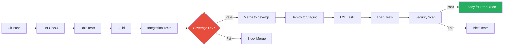

# Testing Strategy

**Project:** SchemaJeli  
**Phase:** 1.3.2 - Infrastructure & DevOps Setup  
**Version:** 1.0  
**Last Updated:** January 30, 2026

## Table of Contents
1. [Overview](#overview)
2. [Test Pyramid](#test-pyramid)
3. [Unit Testing](#unit-testing)
4. [Integration Testing](#integration-testing)
5. [End-to-End Testing](#end-to-end-testing)
6. [API Testing](#api-testing)
7. [Performance Testing](#performance-testing)
8. [Security Testing](#security-testing)
9. [Test Data Management](#test-data-management)
10. [Coverage Requirements](#coverage-requirements)
11. [Testing Tools & Libraries](#testing-tools--libraries)
12. [CI/CD Integration](#cicd-integration)

---

## Overview

SchemaJeli employs a **comprehensive multi-layer testing strategy** to ensure code quality, reliability, and security. Tests run automatically in the CI/CD pipeline, with coverage requirements enforced as quality gates.

### Testing Principles
- ✅ **Test Early, Test Often**: Tests run on every push
- ✅ **Fast Feedback**: Unit tests complete in <2 minutes
- ✅ **Automated**: No manual testing in CI pipeline
- ✅ **Maintainable**: Tests are code - keep them clean and DRY
- ✅ **Realistic**: Test data mirrors production scenarios
- ✅ **Isolated**: Tests don't depend on each other

### Quality Metrics
| Metric | Target | Current | Status |
|--------|--------|---------|--------|
| **Backend Unit Coverage** | ≥80% | TBD | 🟡 Pending |
| **Frontend Unit Coverage** | ≥70% | TBD | 🟡 Pending |
| **Integration Coverage** | ≥60% | TBD | 🟡 Pending |
| **E2E Critical Paths** | 100% | TBD | 🟡 Pending |
| **Build Time** | <12 min | TBD | 🟡 Pending |
| **Test Execution Time** | <8 min | TBD | 🟡 Pending |

---

## Test Pyramid

```
                 ┌──────────────┐
                 │  E2E Tests   │  ← 10 tests (5%)
                 │  ~10 min     │     Critical user flows
                 ├──────────────┤
                 │ Integration  │  ← 30 tests (15%)
                 │   Tests      │     API endpoints
                 │   ~5 min     │
                 ├──────────────┤
                 │ Unit Tests   │  ← 160 tests (80%)
                 │   ~2 min     │     Business logic
                 └──────────────┘
```

### Test Distribution Strategy

| Layer | Count | % | Scope | Speed | Maintenance |
|-------|-------|---|-------|-------|-------------|
| **Unit** | 160 | 80% | Single function/class | ⚡ Fast (ms) | 🟢 Low |
| **Integration** | 30 | 15% | API endpoints + DB | ⚡ Medium (sec) | 🟡 Medium |
| **E2E** | 10 | 5% | Full user workflows | 🐌 Slow (min) | 🔴 High |

**Total estimated tests:** ~200 tests

---

## Unit Testing

### Backend Unit Tests (Vitest)

**Scope:** Individual functions, classes, and modules

**Test Location:** `src/backend/**/*.test.ts` (co-located with source)

**Configuration** (`src/backend/vitest.config.ts`):

```typescript
import { defineConfig } from 'vitest/config';

export default defineConfig({
  test: {
    globals: true,
    environment: 'node',
    coverage: {
      provider: 'v8',
      reporter: ['text', 'lcov', 'html'],
      exclude: [
        'node_modules/',
        'dist/',
        '**/*.test.ts',
        '**/*.spec.ts',
        '**/types.ts',
      ],
      thresholds: {
        statements: 80,
        branches: 80,
        functions: 80,
        lines: 80,
      },
    },
    setupFiles: ['./tests/setup.ts'],
  },
});
```

#### Example: Testing Authentication Service

**File:** `src/backend/services/authService.test.ts`

```typescript
import { describe, it, expect, beforeEach, vi } from 'vitest';
import { AuthService } from './authService';
import { prisma } from '../lib/prisma';
import bcrypt from 'bcrypt';
import jwt from 'jsonwebtoken';

// Mock Prisma client
vi.mock('../lib/prisma', () => ({
  prisma: {
    user: {
      findUnique: vi.fn(),
      create: vi.fn(),
      update: vi.fn(),
    },
    auditLog: {
      create: vi.fn(),
    },
  },
}));

describe('AuthService', () => {
  let authService: AuthService;

  beforeEach(() => {
    authService = new AuthService();
    vi.clearAllMocks();
  });

  describe('login', () => {
    it('should return access token for valid credentials', async () => {
      // Arrange
      const mockUser = {
        id: 'user-123',
        email: 'test@example.com',
        password: await bcrypt.hash('password123', 10),
        role: 'EDITOR',
        status: 'ACTIVE',
      };

      vi.mocked(prisma.user.findUnique).mockResolvedValue(mockUser);

      // Act
      const result = await authService.login('test@example.com', 'password123');

      // Assert
      expect(result).toHaveProperty('accessToken');
      expect(result).toHaveProperty('refreshToken');
      expect(result.user.email).toBe('test@example.com');
      expect(result.user.role).toBe('EDITOR');
    });

    it('should throw error for invalid email', async () => {
      // Arrange
      vi.mocked(prisma.user.findUnique).mockResolvedValue(null);

      // Act & Assert
      await expect(
        authService.login('invalid@example.com', 'password123')
      ).rejects.toThrow('Invalid credentials');
    });

    it('should throw error for incorrect password', async () => {
      // Arrange
      const mockUser = {
        id: 'user-123',
        email: 'test@example.com',
        password: await bcrypt.hash('correctpassword', 10),
        role: 'EDITOR',
        status: 'ACTIVE',
      };

      vi.mocked(prisma.user.findUnique).mockResolvedValue(mockUser);

      // Act & Assert
      await expect(
        authService.login('test@example.com', 'wrongpassword')
      ).rejects.toThrow('Invalid credentials');
    });

    it('should throw error for inactive user', async () => {
      // Arrange
      const mockUser = {
        id: 'user-123',
        email: 'test@example.com',
        password: await bcrypt.hash('password123', 10),
        role: 'EDITOR',
        status: 'INACTIVE',
      };

      vi.mocked(prisma.user.findUnique).mockResolvedValue(mockUser);

      // Act & Assert
      await expect(
        authService.login('test@example.com', 'password123')
      ).rejects.toThrow('Account is inactive');
    });

    it('should create audit log on successful login', async () => {
      // Arrange
      const mockUser = {
        id: 'user-123',
        email: 'test@example.com',
        password: await bcrypt.hash('password123', 10),
        role: 'EDITOR',
        status: 'ACTIVE',
      };

      vi.mocked(prisma.user.findUnique).mockResolvedValue(mockUser);

      // Act
      await authService.login('test@example.com', 'password123');

      // Assert
      expect(prisma.auditLog.create).toHaveBeenCalledWith({
        data: expect.objectContaining({
          action: 'LOGIN_SUCCESS',
          userId: 'user-123',
        }),
      });
    });
  });

  describe('verifyToken', () => {
    it('should return user payload for valid token', () => {
      // Arrange
      const payload = { userId: 'user-123', email: 'test@example.com', role: 'ADMIN' };
      const token = jwt.sign(payload, process.env.JWT_SECRET!, { expiresIn: '15m' });

      // Act
      const result = authService.verifyToken(token);

      // Assert
      expect(result.userId).toBe('user-123');
      expect(result.email).toBe('test@example.com');
      expect(result.role).toBe('ADMIN');
    });

    it('should throw error for expired token', () => {
      // Arrange
      const payload = { userId: 'user-123', email: 'test@example.com', role: 'ADMIN' };
      const token = jwt.sign(payload, process.env.JWT_SECRET!, { expiresIn: '-1s' });

      // Act & Assert
      expect(() => authService.verifyToken(token)).toThrow('Token expired');
    });

    it('should throw error for invalid token', () => {
      // Act & Assert
      expect(() => authService.verifyToken('invalid-token')).toThrow('Invalid token');
    });
  });
});
```

#### Example: Testing Validation Utility

**File:** `src/backend/utils/validation.test.ts`

```typescript
import { describe, it, expect } from 'vitest';
import { validateServerName, validateDatabaseName, validateElementName } from './validation';

describe('Validation Utils', () => {
  describe('validateServerName', () => {
    it('should accept valid server names', () => {
      expect(validateServerName('prod-server-01')).toBe(true);
      expect(validateServerName('DEV_SERVER')).toBe(true);
      expect(validateServerName('server123')).toBe(true);
    });

    it('should reject names with invalid characters', () => {
      expect(validateServerName('server@name')).toBe(false);
      expect(validateServerName('server name')).toBe(false);
      expect(validateServerName('server#1')).toBe(false);
    });

    it('should reject names that are too short', () => {
      expect(validateServerName('ab')).toBe(false);
    });

    it('should reject names that are too long', () => {
      expect(validateServerName('a'.repeat(51))).toBe(false);
    });

    it('should reject empty string', () => {
      expect(validateServerName('')).toBe(false);
    });
  });

  describe('validateDatabaseName', () => {
    it('should accept valid database names', () => {
      expect(validateDatabaseName('my_database')).toBe(true);
      expect(validateDatabaseName('database123')).toBe(true);
    });

    it('should reject reserved SQL keywords', () => {
      expect(validateDatabaseName('SELECT')).toBe(false);
      expect(validateDatabaseName('DROP')).toBe(false);
      expect(validateDatabaseName('TABLE')).toBe(false);
    });

    it('should reject names starting with numbers', () => {
      expect(validateDatabaseName('123database')).toBe(false);
    });
  });
});
```

### Frontend Unit Tests (Vitest + React Testing Library)

**Scope:** React components, hooks, utilities

**Test Location:** `src/frontend/**/*.test.tsx`

**Configuration** (`src/frontend/vitest.config.ts`):

```typescript
import { defineConfig } from 'vitest/config';
import react from '@vitejs/plugin-react';

export default defineConfig({
  plugins: [react()],
  test: {
    globals: true,
    environment: 'jsdom',
    setupFiles: ['./tests/setup.ts'],
    coverage: {
      provider: 'v8',
      reporter: ['text', 'lcov', 'html'],
      exclude: [
        'node_modules/',
        'dist/',
        '**/*.test.tsx',
        '**/*.test.ts',
        '**/types.ts',
      ],
      thresholds: {
        statements: 70,
        branches: 70,
        functions: 70,
        lines: 70,
      },
    },
  },
});
```

#### Example: Testing React Component

**File:** `src/frontend/components/ServerList.test.tsx`

```typescript
import { describe, it, expect, vi } from 'vitest';
import { render, screen, waitFor } from '@testing-library/react';
import userEvent from '@testing-library/user-event';
import { ServerList } from './ServerList';
import { QueryClient, QueryClientProvider } from '@tanstack/react-query';

// Mock API
vi.mock('../services/apiClient', () => ({
  apiClient: {
    get: vi.fn(),
  },
}));

const createWrapper = () => {
  const queryClient = new QueryClient({
    defaultOptions: {
      queries: { retry: false },
    },
  });

  return ({ children }: { children: React.ReactNode }) => (
    <QueryClientProvider client={queryClient}>{children}</QueryClientProvider>
  );
};

describe('ServerList', () => {
  it('should display loading state initially', () => {
    render(<ServerList />, { wrapper: createWrapper() });
    expect(screen.getByText(/loading/i)).toBeInTheDocument();
  });

  it('should display servers when data is loaded', async () => {
    const mockServers = [
      { id: '1', name: 'prod-server', rdbmsType: 'POSTGRESQL', status: 'ACTIVE' },
      { id: '2', name: 'dev-server', rdbmsType: 'MYSQL', status: 'ACTIVE' },
    ];

    const { apiClient } = await import('../services/apiClient');
    vi.mocked(apiClient.get).mockResolvedValue({ data: mockServers });

    render(<ServerList />, { wrapper: createWrapper() });

    await waitFor(() => {
      expect(screen.getByText('prod-server')).toBeInTheDocument();
      expect(screen.getByText('dev-server')).toBeInTheDocument();
    });
  });

  it('should filter servers by search term', async () => {
    const mockServers = [
      { id: '1', name: 'prod-server', rdbmsType: 'POSTGRESQL', status: 'ACTIVE' },
      { id: '2', name: 'dev-server', rdbmsType: 'MYSQL', status: 'ACTIVE' },
    ];

    const { apiClient } = await import('../services/apiClient');
    vi.mocked(apiClient.get).mockResolvedValue({ data: mockServers });

    render(<ServerList />, { wrapper: createWrapper() });

    await waitFor(() => {
      expect(screen.getByText('prod-server')).toBeInTheDocument();
    });

    const searchInput = screen.getByPlaceholderText(/search servers/i);
    await userEvent.type(searchInput, 'prod');

    expect(screen.getByText('prod-server')).toBeInTheDocument();
    expect(screen.queryByText('dev-server')).not.toBeInTheDocument();
  });

  it('should display error message when API fails', async () => {
    const { apiClient } = await import('../services/apiClient');
    vi.mocked(apiClient.get).mockRejectedValue(new Error('API Error'));

    render(<ServerList />, { wrapper: createWrapper() });

    await waitFor(() => {
      expect(screen.getByText(/error loading servers/i)).toBeInTheDocument();
    });
  });
});
```

#### Example: Testing Custom Hook

**File:** `src/frontend/hooks/useAuth.test.ts`

```typescript
import { describe, it, expect, beforeEach, vi } from 'vitest';
import { renderHook, waitFor } from '@testing-library/react';
import { useAuth } from './useAuth';
import { AuthProvider } from '../contexts/AuthContext';

describe('useAuth', () => {
  beforeEach(() => {
    localStorage.clear();
  });

  it('should return null user when not authenticated', () => {
    const { result } = renderHook(() => useAuth(), {
      wrapper: AuthProvider,
    });

    expect(result.current.user).toBeNull();
    expect(result.current.isAuthenticated).toBe(false);
  });

  it('should login user and store token', async () => {
    const { result } = renderHook(() => useAuth(), {
      wrapper: AuthProvider,
    });

    await waitFor(async () => {
      await result.current.login('test@example.com', 'password123');
    });

    expect(result.current.user).not.toBeNull();
    expect(result.current.user?.email).toBe('test@example.com');
    expect(result.current.isAuthenticated).toBe(true);
    expect(localStorage.getItem('accessToken')).toBeTruthy();
  });

  it('should logout user and clear token', async () => {
    const { result } = renderHook(() => useAuth(), {
      wrapper: AuthProvider,
    });

    // Login first
    await waitFor(async () => {
      await result.current.login('test@example.com', 'password123');
    });

    // Then logout
    await waitFor(async () => {
      await result.current.logout();
    });

    expect(result.current.user).toBeNull();
    expect(result.current.isAuthenticated).toBe(false);
    expect(localStorage.getItem('accessToken')).toBeNull();
  });
});
```

---

## Integration Testing

### API Integration Tests (Supertest)

**Scope:** Full API request/response cycle with database

**Test Location:** `tests/integration/**/*.test.ts`

**Setup** (`tests/integration/setup.ts`):

```typescript
import { beforeAll, afterAll, beforeEach } from 'vitest';
import { prisma } from '../../src/backend/lib/prisma';
import { execSync } from 'child_process';

beforeAll(async () => {
  // Apply migrations to test database
  execSync('npx prisma migrate deploy', {
    env: {
      ...process.env,
      DATABASE_URL: process.env.TEST_DATABASE_URL,
    },
  });
});

beforeEach(async () => {
  // Clear all data before each test
  await prisma.auditLog.deleteMany();
  await prisma.element.deleteMany();
  await prisma.table.deleteMany();
  await prisma.database.deleteMany();
  await prisma.server.deleteMany();
  await prisma.abbreviation.deleteMany();
  await prisma.user.deleteMany();
});

afterAll(async () => {
  await prisma.$disconnect();
});
```

#### Example: Testing Server API

**File:** `tests/integration/servers.test.ts`

```typescript
import { describe, it, expect, beforeEach } from 'vitest';
import request from 'supertest';
import { app } from '../../src/backend/app';
import { prisma } from '../../src/backend/lib/prisma';
import { createTestUser, getAuthToken } from '../helpers/auth';

describe('Server API', () => {
  let authToken: string;
  let adminToken: string;

  beforeEach(async () => {
    const editor = await createTestUser('EDITOR');
    const admin = await createTestUser('ADMIN');
    
    authToken = await getAuthToken(editor.email, 'password123');
    adminToken = await getAuthToken(admin.email, 'password123');
  });

  describe('POST /api/servers', () => {
    it('should create new server with valid data (EDITOR role)', async () => {
      const serverData = {
        name: 'test-server',
        rdbmsType: 'POSTGRESQL',
        hostname: 'localhost',
        port: 5432,
        description: 'Test PostgreSQL server',
      };

      const response = await request(app)
        .post('/api/servers')
        .set('Authorization', `Bearer ${authToken}`)
        .send(serverData)
        .expect(201);

      expect(response.body).toMatchObject({
        name: 'test-server',
        rdbmsType: 'POSTGRESQL',
        status: 'ACTIVE',
      });

      // Verify database
      const server = await prisma.server.findUnique({
        where: { id: response.body.id },
      });
      expect(server).toBeTruthy();
      expect(server?.name).toBe('test-server');
    });

    it('should reject duplicate server name', async () => {
      await prisma.server.create({
        data: {
          name: 'existing-server',
          rdbmsType: 'POSTGRESQL',
          status: 'ACTIVE',
        },
      });

      const response = await request(app)
        .post('/api/servers')
        .set('Authorization', `Bearer ${authToken}`)
        .send({
          name: 'existing-server',
          rdbmsType: 'MYSQL',
        })
        .expect(409);

      expect(response.body.error).toContain('already exists');
    });

    it('should reject request without authentication', async () => {
      await request(app)
        .post('/api/servers')
        .send({ name: 'test-server', rdbmsType: 'POSTGRESQL' })
        .expect(401);
    });

    it('should reject request from VIEWER role', async () => {
      const viewer = await createTestUser('VIEWER');
      const viewerToken = await getAuthToken(viewer.email, 'password123');

      await request(app)
        .post('/api/servers')
        .set('Authorization', `Bearer ${viewerToken}`)
        .send({ name: 'test-server', rdbmsType: 'POSTGRESQL' })
        .expect(403);
    });
  });

  describe('GET /api/servers', () => {
    beforeEach(async () => {
      await prisma.server.createMany({
        data: [
          { name: 'server-1', rdbmsType: 'POSTGRESQL', status: 'ACTIVE' },
          { name: 'server-2', rdbmsType: 'MYSQL', status: 'ACTIVE' },
          { name: 'server-3', rdbmsType: 'ORACLE', status: 'INACTIVE' },
        ],
      });
    });

    it('should return all servers with pagination', async () => {
      const response = await request(app)
        .get('/api/servers?page=1&limit=10')
        .set('Authorization', `Bearer ${authToken}`)
        .expect(200);

      expect(response.body.data).toHaveLength(3);
      expect(response.body.pagination).toMatchObject({
        page: 1,
        limit: 10,
        total: 3,
      });
    });

    it('should filter servers by status', async () => {
      const response = await request(app)
        .get('/api/servers?status=ACTIVE')
        .set('Authorization', `Bearer ${authToken}`)
        .expect(200);

      expect(response.body.data).toHaveLength(2);
      expect(response.body.data.every((s: any) => s.status === 'ACTIVE')).toBe(true);
    });

    it('should search servers by name', async () => {
      const response = await request(app)
        .get('/api/servers?search=server-1')
        .set('Authorization', `Bearer ${authToken}`)
        .expect(200);

      expect(response.body.data).toHaveLength(1);
      expect(response.body.data[0].name).toBe('server-1');
    });
  });

  describe('DELETE /api/servers/:id', () => {
    it('should soft delete server (ADMIN only)', async () => {
      const server = await prisma.server.create({
        data: { name: 'test-server', rdbmsType: 'POSTGRESQL', status: 'ACTIVE' },
      });

      await request(app)
        .delete(`/api/servers/${server.id}`)
        .set('Authorization', `Bearer ${adminToken}`)
        .expect(204);

      // Verify soft delete
      const deletedServer = await prisma.server.findUnique({
        where: { id: server.id },
      });
      expect(deletedServer?.deletedAt).toBeTruthy();
    });

    it('should reject delete request from EDITOR role', async () => {
      const server = await prisma.server.create({
        data: { name: 'test-server', rdbmsType: 'POSTGRESQL', status: 'ACTIVE' },
      });

      await request(app)
        .delete(`/api/servers/${server.id}`)
        .set('Authorization', `Bearer ${authToken}`)
        .expect(403);
    });
  });
});
```

---

## End-to-End Testing

### E2E Tests (Playwright)

**Scope:** Critical user workflows in browser

**Test Location:** `tests/e2e/**/*.spec.ts`

**Configuration** (`playwright.config.ts`):

```typescript
import { defineConfig, devices } from '@playwright/test';

export default defineConfig({
  testDir: './tests/e2e',
  fullyParallel: true,
  forbidOnly: !!process.env.CI,
  retries: process.env.CI ? 2 : 0,
  workers: process.env.CI ? 1 : undefined,
  reporter: [
    ['html'],
    ['json', { outputFile: 'test-results/results.json' }],
  ],
  use: {
    baseURL: process.env.BASE_URL || 'http://localhost:5173',
    trace: 'on-first-retry',
    screenshot: 'only-on-failure',
  },
  projects: [
    {
      name: 'chromium',
      use: { ...devices['Desktop Chrome'] },
    },
    {
      name: 'firefox',
      use: { ...devices['Desktop Firefox'] },
    },
    {
      name: 'webkit',
      use: { ...devices['Desktop Safari'] },
    },
  ],
  webServer: {
    command: 'npm run dev',
    url: 'http://localhost:5173',
    reuseExistingServer: !process.env.CI,
  },
});
```

#### Example: Testing Authentication Flow

**File:** `tests/e2e/auth.spec.ts`

```typescript
import { test, expect } from '@playwright/test';

test.describe('Authentication', () => {
  test('should login with valid credentials @smoke', async ({ page }) => {
    // Navigate to login page
    await page.goto('/login');

    // Fill in credentials
    await page.fill('input[name="email"]', 'admin@example.com');
    await page.fill('input[name="password"]', 'SecurePassword123!');

    // Submit form
    await page.click('button[type="submit"]');

    // Verify redirect to dashboard
    await expect(page).toHaveURL('/dashboard');

    // Verify user menu shows logged-in state
    await expect(page.locator('[data-testid="user-menu"]')).toContainText('admin@example.com');
  });

  test('should show error for invalid credentials', async ({ page }) => {
    await page.goto('/login');

    await page.fill('input[name="email"]', 'admin@example.com');
    await page.fill('input[name="password"]', 'wrongpassword');
    await page.click('button[type="submit"]');

    // Verify error message
    await expect(page.locator('[data-testid="error-message"]')).toContainText('Invalid credentials');

    // Verify still on login page
    await expect(page).toHaveURL('/login');
  });

  test('should logout successfully', async ({ page }) => {
    // Login first
    await page.goto('/login');
    await page.fill('input[name="email"]', 'admin@example.com');
    await page.fill('input[name="password"]', 'SecurePassword123!');
    await page.click('button[type="submit"]');
    await expect(page).toHaveURL('/dashboard');

    // Logout
    await page.click('[data-testid="user-menu"]');
    await page.click('[data-testid="logout-button"]');

    // Verify redirect to login
    await expect(page).toHaveURL('/login');

    // Verify cannot access protected routes
    await page.goto('/servers');
    await expect(page).toHaveURL('/login');
  });
});
```

#### Example: Testing Server Management Flow

**File:** `tests/e2e/servers.spec.ts`

```typescript
import { test, expect } from '@playwright/test';

test.describe('Server Management @critical', () => {
  test.beforeEach(async ({ page }) => {
    // Login before each test
    await page.goto('/login');
    await page.fill('input[name="email"]', 'editor@example.com');
    await page.fill('input[name="password"]', 'password123');
    await page.click('button[type="submit"]');
    await expect(page).toHaveURL('/dashboard');
  });

  test('should create new server', async ({ page }) => {
    // Navigate to servers page
    await page.click('a[href="/servers"]');
    await expect(page).toHaveURL('/servers');

    // Click "Add Server" button
    await page.click('[data-testid="add-server-button"]');

    // Fill in server form
    await page.fill('input[name="name"]', 'test-server-playwright');
    await page.selectOption('select[name="rdbmsType"]', 'POSTGRESQL');
    await page.fill('input[name="hostname"]', 'localhost');
    await page.fill('input[name="port"]', '5432');
    await page.fill('textarea[name="description"]', 'Test server created by Playwright');

    // Submit form
    await page.click('button[type="submit"]');

    // Verify success message
    await expect(page.locator('[data-testid="toast-message"]')).toContainText('Server created successfully');

    // Verify server appears in list
    await expect(page.locator('[data-testid="server-list"]')).toContainText('test-server-playwright');
  });

  test('should search for servers', async ({ page }) => {
    await page.goto('/servers');

    // Enter search term
    await page.fill('input[placeholder*="Search"]', 'prod');

    // Verify filtered results
    const serverList = page.locator('[data-testid="server-list"]');
    await expect(serverList.locator('[data-testid="server-item"]')).toHaveCount(1);
    await expect(serverList).toContainText('prod-server');
  });

  test('should view server details', async ({ page }) => {
    await page.goto('/servers');

    // Click on server
    await page.click('[data-testid="server-item"]:has-text("prod-server")');

    // Verify details page
    await expect(page).toHaveURL(/\/servers\/[a-f0-9-]+/);
    await expect(page.locator('h1')).toContainText('prod-server');
    await expect(page.locator('[data-testid="server-rdbms"]')).toContainText('POSTGRESQL');
  });
});
```

---

## API Testing

### Postman Collection

**Purpose:** Manual API testing and documentation

**Collection Structure:**
```
SchemaJeli API.postman_collection.json
├── Authentication
│   ├── Login
│   ├── Refresh Token
│   └── Logout
├── Servers
│   ├── List Servers
│   ├── Get Server
│   ├── Create Server
│   ├── Update Server
│   └── Delete Server
├── Databases
├── Tables
├── Elements
└── Reports
```

**Environment Variables:**
- `base_url`: `https://api.schemajeli.com`
- `auth_token`: (auto-populated from login response)

---

## Performance Testing

### Load Testing (k6)

**Configuration** (`tests/performance/load-test.js`):

```javascript
import http from 'k6/http';
import { check, sleep } from 'k6';

export const options = {
  stages: [
    { duration: '1m', target: 10 },  // Ramp up to 10 users
    { duration: '3m', target: 10 },  // Stay at 10 users
    { duration: '1m', target: 50 },  // Ramp up to 50 users
    { duration: '3m', target: 50 },  // Stay at 50 users
    { duration: '1m', target: 0 },   // Ramp down to 0 users
  ],
  thresholds: {
    http_req_duration: ['p(95)<500'], // 95% of requests under 500ms
    http_req_failed: ['rate<0.05'],   // Error rate under 5%
  },
};

export default function () {
  // Login
  const loginRes = http.post(`${__ENV.BASE_URL}/api/auth/login`, JSON.stringify({
    email: 'test@example.com',
    password: 'password123',
  }), {
    headers: { 'Content-Type': 'application/json' },
  });

  check(loginRes, {
    'login status is 200': (r) => r.status === 200,
    'login returns token': (r) => r.json('accessToken') !== '',
  });

  const token = loginRes.json('accessToken');

  // List servers
  const serversRes = http.get(`${__ENV.BASE_URL}/api/servers`, {
    headers: { 'Authorization': `Bearer ${token}` },
  });

  check(serversRes, {
    'servers status is 200': (r) => r.status === 200,
    'servers response time OK': (r) => r.timings.duration < 500,
  });

  sleep(1);
}
```

**Run:**
```bash
k6 run tests/performance/load-test.js --env BASE_URL=https://api-staging.schemajeli.com
```

---

## Security Testing

### Dependency Scanning (Snyk)

**CI Integration:**
```yaml
- name: Run Snyk security scan
  uses: snyk/actions/node@master
  env:
    SNYK_TOKEN: ${{ secrets.SNYK_TOKEN }}
  with:
    args: --severity-threshold=high
```

### OWASP ZAP (Penetration Testing)

**Target:** Staging environment before production deployment

**Scan Types:**
- ✅ Baseline scan (passive)
- ✅ Full scan (active - staging only)
- ✅ API scan (OpenAPI spec)

**CI Integration:**
```yaml
- name: OWASP ZAP Baseline Scan
  uses: zaproxy/action-baseline@v0.7.0
  with:
    target: 'https://staging.schemajeli.com'
    rules_file_name: '.zap/rules.tsv'
    cmd_options: '-a'
```

---

## Test Data Management

### Seed Data

**File:** `src/backend/prisma/seed.ts`

```typescript
import { PrismaClient } from '@prisma/client';
import bcrypt from 'bcrypt';

const prisma = new PrismaClient();

async function main() {
  console.log('Seeding database...');

  // Create users
  const adminPassword = await bcrypt.hash('admin123', 10);
  const admin = await prisma.user.upsert({
    where: { email: 'admin@example.com' },
    update: {},
    create: {
      email: 'admin@example.com',
      password: adminPassword,
      name: 'Admin User',
      role: 'ADMIN',
      status: 'ACTIVE',
    },
  });

  // Create servers
  const server = await prisma.server.create({
    data: {
      name: 'prod-postgres-01',
      rdbmsType: 'POSTGRESQL',
      hostname: 'db.production.internal',
      port: 5432,
      status: 'ACTIVE',
      description: 'Production PostgreSQL server',
    },
  });

  // Create database
  const database = await prisma.database.create({
    data: {
      name: 'main_db',
      serverId: server.id,
      status: 'ACTIVE',
      description: 'Main application database',
    },
  });

  // Create table
  const table = await prisma.table.create({
    data: {
      name: 'users',
      databaseId: database.id,
      tableType: 'TABLE',
      status: 'ACTIVE',
      description: 'User accounts table',
    },
  });

  // Create elements (columns)
  await prisma.element.createMany({
    data: [
      { name: 'id', tableId: table.id, dataType: 'UUID', nullable: false, isPrimaryKey: true },
      { name: 'email', tableId: table.id, dataType: 'VARCHAR(255)', nullable: false },
      { name: 'name', tableId: table.id, dataType: 'VARCHAR(255)', nullable: true },
    ],
  });

  console.log('✅ Seed data created');
}

main()
  .catch((e) => {
    console.error(e);
    process.exit(1);
  })
  .finally(async () => {
    await prisma.$disconnect();
  });
```

**Run:**
```bash
npm run db:seed
```

---

## Coverage Requirements

### Coverage Thresholds

| Metric | Backend | Frontend | Integration |
|--------|---------|----------|-------------|
| **Statements** | ≥80% | ≥70% | ≥60% |
| **Branches** | ≥80% | ≥70% | ≥60% |
| **Functions** | ≥80% | ≥70% | ≥60% |
| **Lines** | ≥80% | ≥70% | ≥60% |

### Coverage Enforcement

**CI Pipeline fails if coverage drops below thresholds**

```yaml
- name: Run tests with coverage
  run: npm run test:coverage
  
- name: Check coverage thresholds
  run: |
    if [ $(jq '.total.lines.pct' coverage/coverage-summary.json | cut -d. -f1) -lt 80 ]; then
      echo "❌ Coverage below 80%"
      exit 1
    fi
```

---

## Testing Tools & Libraries

### Backend Testing

| Tool | Version | Purpose |
|------|---------|---------|
| **Vitest** | ^1.0.0 | Test runner |
| **Supertest** | ^6.3.3 | HTTP assertions |
| **@vitest/coverage-v8** | ^1.0.0 | Code coverage |

### Frontend Testing

| Tool | Version | Purpose |
|------|---------|---------|
| **Vitest** | ^1.0.0 | Test runner |
| **@testing-library/react** | ^14.0.0 | Component testing |
| **@testing-library/user-event** | ^14.5.1 | User interactions |
| **@testing-library/jest-dom** | ^6.1.5 | Custom matchers |

### E2E Testing

| Tool | Version | Purpose |
|------|---------|---------|
| **Playwright** | ^1.40.0 | Browser automation |
| **@playwright/test** | ^1.40.0 | Test runner |

### Performance Testing

| Tool | Version | Purpose |
|------|---------|---------|
| **k6** | ^0.48.0 | Load testing |

### Security Testing

| Tool | Version | Purpose |
|------|---------|---------|
| **Snyk** | Latest | Dependency scanning |
| **OWASP ZAP** | Latest | Penetration testing |

---

## CI/CD Integration

### Test Execution Flow



### Test Metrics Dashboard

**Track in GitHub Actions:**
- Test execution time trends
- Test success/failure rates
- Coverage trends over time
- Flaky test identification

---

## Implementation Checklist

### Phase 1: Unit Testing Setup (Week 1)

- [ ] Configure Vitest for backend
- [ ] Configure Vitest + React Testing Library for frontend
- [ ] Write 20 backend unit tests (services, utils)
- [ ] Write 15 frontend unit tests (components, hooks)
- [ ] Set up coverage reporting
- [ ] Integrate with CI pipeline

### Phase 2: Integration Testing (Week 2)

- [ ] Set up test database
- [ ] Configure Supertest
- [ ] Write 10 API integration tests
- [ ] Implement test helpers (auth, factories)
- [ ] Add to CI pipeline

### Phase 3: E2E Testing (Week 3)

- [ ] Configure Playwright
- [ ] Write 5 critical path E2E tests
- [ ] Implement page object models
- [ ] Set up test environments
- [ ] Add to staging deployment pipeline

### Phase 4: Performance & Security (Week 4)

- [ ] Set up k6 load testing
- [ ] Write baseline load test scenarios
- [ ] Configure Snyk scanning
- [ ] Set up OWASP ZAP scanning
- [ ] Document performance benchmarks

---

**Document Status:** ✅ Complete  
**Next Step:** Proceed to P-1.3.3 (Monitoring & Logging Architecture)
